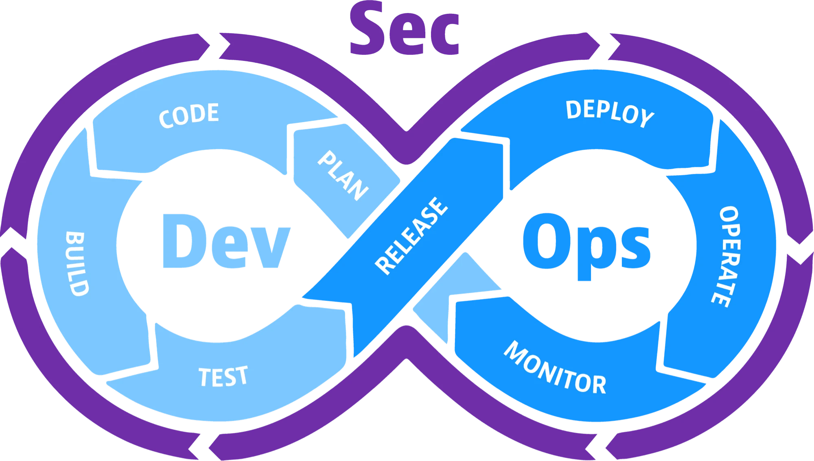
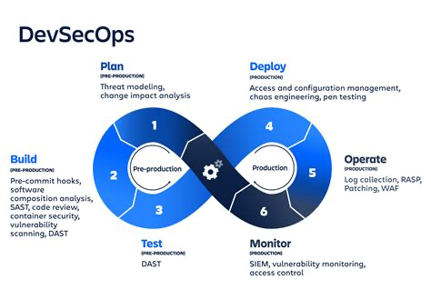

**Table of Content**
- [1. Cloud-Native Beginner Journey: From Kubernetes Orchestration to Secure Deployments](#1-cloud-native-beginner-journey-from-kubernetes-orchestration-to-secure-deployments)
  - [1.1. Workshop Information](#11-workshop-information)
  - [1.2. Workshop Lab Setup Prerequisite](#12-workshop-lab-setup-prerequisite)
  - [1.3. Kubernetes Cluster Installation](#13-kubernetes-cluster-installation)
  - [1.4. Example Applications](#14-example-applications)
  - [1.5. DevSecOps](#15-devsecops)
  - [1.6. Build A Application](#16-build-a-application)
  - [1.7. Learning Materials](#17-learning-materials)
- [2. References](#2-references)

# 1. Cloud-Native Beginner Journey: From Kubernetes Orchestration to Secure Deployments

## 1.1. Workshop Information

- Workshop Title: "Cloud-Native Beginner Journey: From Kubernetes Orchestration to Secure Deployments"
- Location: Department of CSE, RP Shaha University
- Date: 15 Oct 2025

## 1.2. Workshop Lab Setup Prerequisite
- [Follow me for Home-Lab Prerequisite](./../../installation/home-lab-preparation/README.md)

## 1.3. Kubernetes Cluster Installation

- [Follow me for Kubernetes Home-Lab Cluster Installation Procedure](./../../installation/kubernetes-lab-setup/READEME.md)

## 1.4. Example Applications

- [Exmaple Applications Home](./../../docs/example-applications/README.md)
- [Kubernetes Cheat Sheet](./docs/kubernetes-cheatsheet.md)

## 1.5. DevSecOps

## 1.6. Build A Application

[Build A Python Application](./../../build/README.md)

## 1.7. Learning Materials

- https://landscape.cncf.io
- https://www.cncf.io/training/certification/
- https://www.cncf.io/training/
- https://owasp.org/www-project-kubernetes-top-ten/

# 2. References